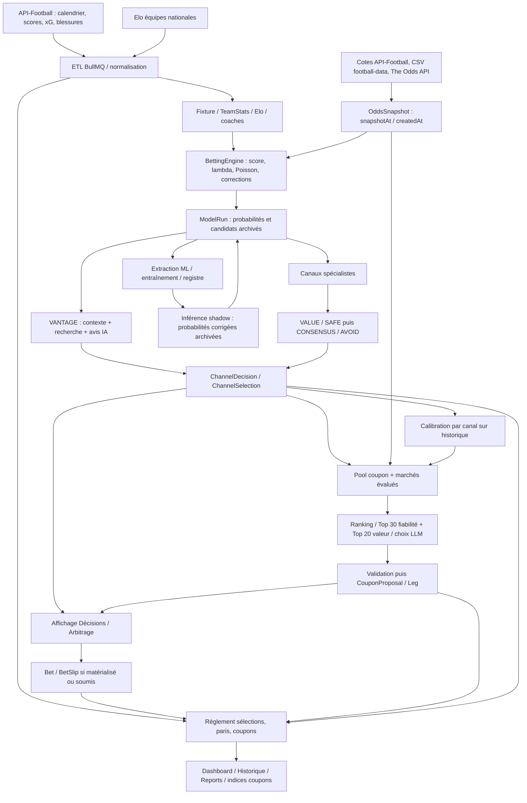

# Audit EVCore — dépôt et base Docker locale

Audit commencé le 13 septembre 2026, poursuivi le 14 septembre. Aucune modification du moteur, des modèles, des règles de sélection ou de la base. Les requêtes utilisent `BEGIN … READ ONLY`, puis `ROLLBACK`, dans le conteneur local `evcore-postgres`, base `evcore`, identifié avec l'utilisateur. Aucun fichier `.env`, secret, compte utilisateur ou accès de production n'a été consulté.

**Conclusion : les éléments disponibles ne démontrent pas d'avantage rentable et stable. Avant de chercher un meilleur modèle, il faut rendre les décisions historiques attribuables, corriger l'évaluation et empêcher l'admission de coupons dont l'espérance annoncée est déjà négative.** Cela ne signifie pas que chaque composant est inutile ; cela signifie que les anciens verdicts « validé », « fiable » ou « PASS » ne constituent pas une preuve suffisante.

## Résultats essentiels

- Sur **3 631 matchs** disposant d'une distribution 1X2 et d'une cote complète enregistrée avant l'analyse, Brier EVCore **0,6389**, bookmaker normalisé **0,5990** : EVCore est moins bon sur cette mesure appariée. La distribution exportée est celle de `features.probabilities`, après les corrections du moteur, avant les filtres des canaux ; ce n'est pas le Poisson sans correction.
- Les dernières sélections enregistrées avant match donnent notamment **VALUE −10,9 %**, **SAFE −4,2 %**, **BTTS −5,8 %**, **DRAW −4,3 %**, **DOUBLE_CHANCE −3,6 %** de ROI simulé à mise fixe. **Les versions déterministes ne sont pas identifiables** : ces agrégats mélangent potentiellement plusieurs versions, explicitement nommées `UNVERSIONED` dans tous les résultats.
- **39 090 / 62 483 ModelRun** ont été enregistrés après le début du match. **337 / 619 coupons** ont été générés après le début de leur première rencontre. Ce ne sont pas des publications prématch démontrées.
- Les **282 coupons enregistrés avant leur première rencontre** totalisent **−37,109 unités, ROI −13,16 %**, IC bootstrap par jour **[−41,52 % ; +18,14 %]**. Les 337 autres affichent **+28,74 %** : mélanger ces deux populations change le récit du produit.
- Les **44 coupons dont toutes les jambes portent `llmReasoning`** sont tous enregistrés avant match, avec **ROI −74,11 %**, IC descriptif **[−91,78 % ; −56,96 %]**. Ce marqueur reconnaît une forme de données du composeur IA, pas une version exacte. L'échantillon est petit et les coupons se recouvrent.
- **22 / 44 de ces coupons ont une EV annoncée négative**, avant même de connaître les résultats. Avant correction, le validateur acceptait effectivement un exemple à **−43,75 % d'EV** : [sortie capturée](negative-ev-proof.json). La [régression exécutable](reproduce-negative-ev.cjs) vérifie désormais son rejet.

Les intervalles ne corrigent ni les données mal horodatées, ni les changements de modèle, ni les multiples hypothèses déjà essayées. Ils ne sont pas des autorisations de mise en production.

## A. État des lieux et architecture



Points d'introduction d'erreur : dates de connaissance dans B/C/F ; paramètres non versionnés dans G ; sélection répétée ou survivante dans I/K ; historique mélangé dans R/ML ; cotes actualisées et preuve de publication dans P/Q/U ; incohérences de règlement dans S ; dénominateurs différents dans M.

### Services et cadence

Sources de code : [constantes ETL](../../../apps/backend/src/config/etl.constants.ts), [orchestration](../../../apps/backend/src/modules/etl/etl.service.ts), [moteur](../../../apps/backend/src/modules/betting-engine/betting-engine.service.ts), [génération IA](../../../apps/vantage-worker/src/coupon/run-coupon-generation.ts).

| Étape | Services / workers / files | Cadence définie dans le code |
|---|---|---|
| Calendrier et résultats | `league-sync`, `fixtures-sync`, `stale-scheduled-sync` | Synchronisation quotidienne ; réparation des matchs anciens |
| Statistiques et contexte | `stats-sync`, `RollingStatsService`, `injuries-sync`, `coach-sync`, `elo-sync` | Stats 04:00 UTC, blessures 06:00, Elo 03:00, coaches hebdomadaires |
| Cotes | `odds-prematch-sync`, `odds-csv-import`, `odds-historical-import` | Plusieurs passages prématch ; CSV hebdomadaire ; import historique distinct |
| Analyse | `betting-engine`, `same-day-analysis`, `rolling-horizon` | Analyse du lendemain et réanalyses intrajournalières ; horizon glissant |
| Reconstruction | `betting-engine-rebuild` | Recalcul de matchs terminés ; à isoler des preuves live |
| ML | `ml-training`, `ml-scheduler`, worker Python, registre FastAPI | Entraînement / activation / inférence shadow |
| IA / coupons | worker VANTAGE, sweep / queue, passes soir et intraday | Pool, calibration, appel LLM, validation, persistance |
| Règlement | `pending-bets-settlement-sync`, `BetSettlementService`, `ChannelDecisionService`, `CouponSettlementService` | Passage configuré toutes les 30 minutes, rattrapages possibles |

Les horaires et flags ci-dessus sont des valeurs de code, pas une inspection des variables d'environnement en cours. `docker ps` confirme PostgreSQL, PgBouncer, Redis et le worker ML ; il ne prouve pas que tous les workers backend du dépôt tournent actuellement.

### Objets à ne pas confondre

| Objet | Stockage et sens | Limite de preuve |
|---|---|---|
| Prédiction avant filtres | `model_run.features.probabilities`, `evaluatedPicks`, `candidatePicks` | Distribution déjà transformée par le moteur ; plusieurs analyses d'un match |
| Décision | `channel_decision.status`, `reasonCode`, `reasonDetails`, `configVersion` | Un rejet fait partie de l'historique ; ne pas l'effacer de la cohorte en cherchant une ancienne sélection |
| Sélection | `channel_selection.probability`, `odds`, `ev`, `rank`, `result`, `settledAt` | Une ligne n'est ni une mise réelle ni une impression prouvée dans l'interface |
| Pari | `bet.probEstimated`, `oddsSnapshot`, `source`, `status`, `stakePct` | MODELE / UTILISATEUR distincts ; règlement financier interne de référence |
| Coupon proposé | `coupon_proposal`, `coupon_proposal_leg` | Pas nécessairement accepté ni joué ; génération rétrospective possible |
| Coupon soumis | `bet_slip`, `bet_slip_item`, lien de placement | Distinct de la proposition automatique ; hors mesure de revenu réel ici |
| Résultat | Scores `fixture`, résultats analytiques et résultats des paris | Annulation, remboursement et attente doivent rester distincts |

[Schéma](../../../packages/db/prisma/schema.prisma) : `Fixture.externalId` unique ; `ModelRun` indexé mais multi-passages autorisés ; `ChannelDecision` unique sur run/canal ; `ChannelSelection` unique sur décision/rang ; `CouponProposalLeg` ne référence pas directement la sélection ni le run ; `MlModelVersion` conserve artefacts/métriques mais aucune FK ne lie un run à la version ML réellement appelée.

L'évolution du schéma contient des migrations de renommage, ajout de canaux, séparation des décisions/sélections, phase du run, `realizedOdds`, et historique VANTAGE. **84 migrations appliquées** dans la copie. La contrainte particulière `OddsSnapshot UNIQUE NULLS NOT DISTINCT` est documentée dans le schéma et sa migration du 15 août : c'est un garde-fou utile contre les doublons 1X2 à pick nul.

## B. Constats vérifiés

Les preuves SQL complètes sont dans [inventory.txt](inventory.txt), [integrity.txt](integrity.txt), [diagnostics.txt](diagnostics.txt). Le niveau « élevé » signifie que le comportement ou les lignes existent ; il ne signifie pas que leur contribution exacte à la perte a été causalement estimée.

| ID / priorité | Preuve | Impact et cause | Confiance / vérification restante |
|---|---|---|---|
| B1 — P0 | 39 055 ADVANCE et 35 PRE_KICKOFF analysés après kickoff ; 56 209 sélections rattachées à des analyses après kickoff | Le nom de phase ne garantit pas une décision anticipée. Les reconstructions peuvent entrer dans les statistiques | Élevée. Vérifier contre un calendrier historisé pour les reports ; le kickoff actuel peut avoir changé |
| B2 — P0 | 738 197 décisions sans `configVersion` ; aucun identifiant de version déterministe dans les clés JSON inventoriées | Impossible de comparer exactement les versions ou de reconstituer tous les paramètres d'un run | Élevée. Relier commit, configuration et artefact aux décisions futures ; retrouver des journaux de déploiement existants |
| B3 — P0 | `DashboardRepository.findChannelSelectionsInRange` récupère les sélections réglées sans borne `analyzedAt < kickoff`, sans déduplication, sans version | « Historique vérifiable » peut compter reconstructions et répétitions. 30 997 groupes match/canal/marché/pick sont répétés dans la base | Élevée. Réconcilier cet endpoint avec l'extraction dédupliquée, puis journal de publication |
| B4 — P0 | `PointInTimeLoader.loadTeamStats` filtre `afterFixture.scheduledAt`, pas `TeamStats.createdAt` ; `loadOdds` ne sélectionne pas `createdAt` | Le commentaire promet une disponibilité historique que les requêtes ne garantissent pas. 116 172 / 124 728 stats enregistrées plus d'un jour après leur match | Élevée sur l'écart. Une ingestion tardive n'est pas à elle seule une fuite de résultat ; elle empêche de prouver la disponibilité à cette date |
| B5 — P0 | `computeChannelReliability` du backend et du worker filtre la date du match, pas `settledAt`, ni la création, ni la version, ni les doublons | Le calibrateur d'un rejeu peut apprendre de résultats qui n'étaient pas encore réglés et surpondérer les matchs réanalysés. Au cutoff 01/08, 10 lignes éligibles ont un règlement enregistré après cette date | Élevée. Ce retard de règlement prouve un défaut de disponibilité dans EVCore, pas nécessairement une inconnue chez le fournisseur |
| B6 — P0 | Extraction ML `_ODDS_LATERAL_SQL` : dernières cotes Pinnacle/Bet365 sans cutoff ; split trié par `analyzedAt`, sans fixture ID dans le dataset | Information de marché ultérieure, ordre de reconstruction confondu avec ordre des événements, possibilité d'un même match dans train et test | Élevée sur le code ; quantifier le chevauchement par fixture après refonte de l'extraction |
| B7 — P0 | ML entraîné seulement sur `delta_p` non nul ; `buildMlShadowFeatures` envoie toujours `delta_p: null` | La comparaison au marché, centrale à l'entraînement, devient une valeur imputée à l'inférence. Distribution train/live différente | Élevée. Rejouer exactement le contrat d'inférence avec les features d'entraînement, sans réentraîner immédiatement |
| B8 — P0 | `validateCouponSelection` retourne `valid` après calcul de `couponEV`, sans test de positivité ; plancher d'edge limité à VALUE, exclu du pool ordinaire | Admission de paris à espérance annoncée négative. Cas exécutable à −43,75 %, 60 / 282 coupons avant match à EV annoncée négative | Élevée. Tester un garde-fou après calibration, au niveau jambe et coupon, sur un jeu non utilisé pour choisir les seuils |
| B9 — P0 | `classifyAvoidSignal(true,true) === KEEP` | Deux alertes réunies peuvent réadmettre un pick ; le texte « exclu du staking » dans certains types/commentaires est trop absolu | Élevée. Les autres garde-fous peuvent encore rejeter la jambe ; admission finale à vérifier sur un journal de pool figé |
| B10 — P0 | Trois sélections gagnantes sur un match désormais CANCELLED ; un Bet WON lié à une sélection LOST ; 20 sélections de matchs FINISHED depuis plus d'un jour sans règlement | La vérité sportive, analytique et financière n'est pas totalement réconciliée | Élevée. Exclure les matchs annulés/reportés de la mesure descriptive ; investiguer les corrections de score avant toute réparation DB |
| B11 — P1 | `persistCouponProposal` peut remplacer les jambes et `generatedAt` d'une proposition PENDING ; snapshot des jambes sans identifiants run/sélection/cote | L'état conservé ne reconstitue pas nécessairement toutes les propositions vues ; un rejeu exact du LLM est impossible avec les seules lignes actuelles | Élevée. Historique append-only de proposition et des candidats, prompt/model/config/hash nécessaires |
| B12 — P0 | Une justification VANTAGE cite des scores 2:1 comme preuve d'« un seul but » et de BTTS NO | Contradiction vérifiable ; le texte fluide peut rendre crédible une mauvaise interprétation | Élevée. Exemple précis ci-dessous ; pas de taux d'hallucination extrapolé à partir de cinq textes |

Autres contrôles : zéro probabilité hors [0,1], zéro cote enregistrée ≤1 dans les sélections ; **41 395 cotes manquantes** ; zéro doublon strict domicile/extérieur/kickoff, sans exclure des doublons sous identifiants ou dates différents ; zéro groupe de Bet modèle dupliqué selon fixture/pickKey. Les 1 181 sélections sur matchs POSTPONED et 65 sur CANCELLED sans résultat doivent être distinguées des perdantes. Aucun règlement n'a été déclenché pendant l'audit.

Les cotes sont horodatées, mais **5 546 snapshots se situent après le kickoff actuel**. L'assemblage principal utilise une borne de snapshot ; cela ne garantit ni l'heure de collecte initiale, ni un prix encore disponible. L'import CSV affecte à la date du match **12:00 UTC** (`parseDate`, `odds-csv-import.worker.ts`) : cette heure construite n'est pas une heure de cotation observée. L'import historique conserve un `source` distinct ; des CSV construits passent par le défaut PREMATCH. Une cote PREMATCH ne doit donc pas être tenue pour une preuve de cotation live à elle seule.

Les valeurs absentes ne deviennent pas toutes zéro : le code de rolling xG distingue les matchs avec xG complets et les replis sur buts ; `resolveEffectiveTeamStats` applique des replis intercompétitions / début de saison ; l'imputation ML est médiane ou catégorie `unknown`. Il faut conserver leur provenance pour séparer une estimation issue des buts d'un xG fournisseur. Les flags blessures et compositions restent inactifs dans le scoring actuel ; H2H et congestion sont actifs dans le code.

### Ce que valent les anciens rapports

[Inventaire des 50 scripts DB et des rapports présents](script-report-index.md). Aucun script chargeant `dotenv/config`, reconstruisant la base ou entraînant un modèle n'a été lancé. Les calculs de cet audit sont indépendants de leurs verdicts.

| Ancienne assertion / tentative | Vérification dans le dépôt actuel | Conclusion de cet audit |
|---|---|---|
| README « validé », Brier 0,592, ROI +2,28 % | Périmètre historique différent, pas d'attribution exacte au modèle courant | Ne pas réutiliser comme performance actuelle ; comparaison appariée actuelle défavorable au modèle |
| Business model : coupon test +61,8 %, PASS | `formation-content-maintenance.md` reconnaît l'absence du script/rapport source ; ces fichiers ne figurent pas dans les rapports présents | Non reproductible ; retirer cette assertion des preuves de validation |
| Audit du 22 août : DRAW / DOUBLE_CHANCE rentables après shrinkage | Notre cohorte enregistrée avant match est négative pour les deux ; périodes, versions, déduplication et reconstructions diffèrent | Ne prouve ni que le document était faux à sa date, ni que ses canaux sont bons aujourd'hui |
| Backtest canaux virtuels : 81–87 % de réussite | `dbPicksQuery` ne borne pas le run avant kickoff ; rapport contenant des picks sans cote ; couvre une année encore incomplète à génération | Taux de victoire ≠ ROI ; pas une validation de publication historique |
| Audit des pertes virtuelles | `fixtureDiagnosticsQuery` rattache le dernier run à chaque match, sans conserver celui ayant généré le pick audité | Peut expliquer une sélection avec les features d'une autre analyse |
| Shrinkage par ligue / marché | `ou-shrinkage-generate-config.py` décide quoi livrer selon les résultats nommés « test », puis réestime sur tout l'échantillon | Ces résultats sont de la validation de sélection, pas un test final intact. Un nouveau test futur est nécessaire |
| H2H / congestion additionnels | Scripts utilisent une séparation 70/30 et des mathématiques partagées, mais pas un troisième test futur ; le baseline intègre déjà des coefficients choisis lors d'autres essais | Amélioration conditionnelle documentée ; indépendance globale des essais non démontrée |
| Shrinkage de proba coupon du 20 août | Rapport : 106 coupons, train 79/test 27, arrêt pour volume insuffisant | Ce rapport ne valide aucun coefficient |
| Harnais « sans fuite » | `BacktestRunner` assemble les entrées ; il ne reproduit pas la sortie complète du moteur. Congestion lit l'état SCHEDULED actuel ; stats/cotes n'ont pas toutes les bornes de connaissance | Brique utile, garantie surestimée ; à compléter avant de certifier un rejeu |

Un découpage chronologique à l'intérieur d'un script ne suffit pas si les paramètres du baseline ont déjà été choisis en consultant la période évaluée. Multiplier les essais sur les mêmes saisons transforme progressivement le test en validation.

## C. Modèles, métriques et décision par canal

### Modèles réellement identifiables

| Famille | Calcul / entraînement / déploiement | Ce que prouve la base |
|---|---|---|
| POISSON_MAIN | Features forme, xG, performance domicile/extérieur, volatilité ; lambdas domicile/extérieur ; distribution Poisson ; facteurs ligue, shrinkage, H2H et congestion. Mi-temps dérivée notamment par fraction fixe 0,44 | 62 107 runs, enregistrés du 30/06 au 13/09. Des matchs beaucoup plus anciens ont été reconstruits. Versions exactes et périodes d'exploitation inconnues |
| FRI_ELO_POISSON | Modèle de matchs amicaux à partir d'Elo national, puis Poisson | 112 runs, tous enregistrés lors du lot du 30/06 ; pas de cohorte prospective exploitable ici |
| ODDS_DEVIG | Probabilités issues des cotes normalisées, repli du modèle FRI | 72 runs du même lot ; référence marché, pas preuve d'une information prédictive indépendante |
| Source inconnue | Repli / absence de signal identifiable | 192 runs ; aucune attribution inventée |
| Correction ML | Régression logistique `C=1`, max_iter=1000, classes équilibrées ; ou XGBoost 150 arbres, profondeur 4, lr 0,05, subsample/colsample 0,8, min_child_weight 5, seed 42, calibration isotonic cv=3 | 118 versions enregistrées, dont 15 actives toutes XGBoost. Les dates, UUID et métriques actives sont dans `integrity.txt`. « Actif » ne prouve pas l'utilisation dans les décisions |
| VANTAGE | Avis LLM à partir des canaux, contexte et recherche ; probabilité proposée par le LLM ; validation de marché/pick/cote et de certains signaux | `vantage-v2-research` et `vantage-v3-context` renseignés. Historique append-only : 2 609 tentatives depuis le 08/09 ; les modifications de contexte peuvent exister au sein d'un même label v3 |

Le chemin `computeShadowMlByChannel` archive `correctedP`/`edgeDelta` **après** la persistance des décisions et ne les réinjecte pas dans celles-ci. L'inférence n'exporte pas de model ID. On ne peut donc pas attribuer les pertes du moteur déterministe au « dernier XGBoost » ni associer honnêtement une correction historique à la version actuellement active.

Le ML utilise 11 features numériques et 4 catégorielles définies dans [correction.py](../../../apps/ml-worker/src/models/correction.py). Entraînement sur sélections réglées, non sur tous les matchs/candidats ; split 70/30 par lignes ordonnées `analyzed_at`, pas de validation intermédiaire + test final. La calibration interne `cv=3` ne préserve pas un protocole chronologique par fixture. `_devig_pick` peut produire 1 lorsqu'un seul côté est disponible ; HOME/AWAY de « gagner une mi-temps » ne sont pas des événements complémentaires exclusifs. Ces deux cas demandent correction du contrat de marché avant d'interpréter `delta_p`.

Le [registre complet des 118 versions](models.json) conserve pour chaque UUID le segment, l'algorithme, les features, métriques et dates enregistrées. Les hyperparamètres historiques, bornes exactes des datasets, manifestes de déploiement et prédictions réellement servies par cet UUID ne sont pas présents dans ces colonnes ; les paramètres décrits ci-dessus sont ceux du code actuel, pas une attribution aux anciens artefacts.

### Cohortes et formules utilisées dans cet audit

1. Dernière décision **par match/canal**, avec `ModelRun.analyzedAt`, `ModelRun.createdAt` et `ChannelDecision.createdAt` strictement antérieurs au kickoff actuel. Le choix du dernier run précède le filtrage SELECTED ; un rejet récent ne fait pas ressusciter une ancienne sélection.
2. Sélection de rang 1 créée avant kickoff. Matchs actuellement annulés/reportés exclus des résultats de canal ; absence de cote comptée mais jamais remplacée par une cote inventée.
3. WON/LOST pour calibration ; WON/LOST/VOID cotés pour ROI, mise initiale 1 par sélection, profit VOID=0. Pour DNB, la calibration WON/LOST est conditionnelle aux matchs non nuls ; ce n'est pas la probabilité inconditionnelle d'une victoire.
4. `gain = cote − 1` si gagné, `−1` si perdu, `0` si remboursé. `ROI = somme(gains) / nombre de mises`. Pas de Kelly, de frais ni de paris réellement encaissés chez un bookmaker.
5. `Brier binaire = moyenne((p−y)²)` ; Brier 1X2 = somme des trois erreurs carrées, puis moyenne par match. Ils n'ont pas la même échelle : ne pas comparer 0,099 sur score exact à 0,639 sur 1X2 pour choisir un modèle.
6. Calibration en 10 classes de probabilité ; `ECE = Σ n_bin/N × |p_moyenne − fréquence observée|`. Le worker ML appelle calibrationError une **moyenne non pondérée** des erreurs par bin : ce n'est pas la même ECE.
7. Bookmaker implicite `1/cote`. Pour notre comparaison 1X2 : une seule ligne complète bookmaker, connue avant analyse, `marge = Σ1/cote − 1`, `p_fair = (1/cote)/Σ1/cote`. Marge moyenne **5,78 %**, âge moyen des cotes **10,05 h**. Ce n'est pas une garantie de fraîcheur de chaque prix.
8. Drawdown en unités sur résultats ordonnés par `settledAt`, avec départ à zéro ; séries de pertes dans le même ordre. L'ordre des règlements simultanés est départagé par ID. Cela ne modélise pas les fonds immobilisés avant règlement.
9. IC ROI : 2 000 rééchantillonnages de journées entières, seed 20260913. Conserve une partie de la dépendance intrajournalière, pas toutes les dépendances interjours/équipes. Si tous les rendements observés sont identiques, l'intervalle bootstrap est signalé non estimable, pas présenté comme certitude.

Les métriques complètes, cotes moyennes, probabilités implicites, courbes par bins, nombres de décisions/rejets/sélections, mois, ligues, tranches de cote, EV, drawdowns et IC sont dans [metrics.json](metrics.json). Le [tableau lisible](metrics.md) résume les canaux cotés. La calibration incluant les sélections sans cote est conservée séparément dans `calibration_including_missing_odds`.

L'[explorateur de calibration](calibration.html) permet de sélectionner le canal et la population avec ou sans cote, de voir la courbe et les effectifs des bins. Il fonctionne hors ligne ; il affiche des données descriptives et ne transforme pas une ECE faible en validation économique.

### Décisions recommandées — aucune appliquée

Toutes les lignes déterministes ci-dessous sont `POISSON_MAIN / UNVERSIONED`, donc descriptives de versions potentiellement mélangées. N inclut les remboursements pour le ROI. Aucune ligne n'est déclarée rentable hors échantillon.

| Canal | N réglés cotés | ECE binaire | ROI | Stabilité / lecture | Décision proposée |
|---|---:|---:|---:|---|---|
| VALUE | 727 | 21,6 % | −10,9 % | Juil +4,4 %, août −10,6 %, sept −24,2 % | Suspendre comme recommandation de valeur ; recalibrer avant nouvelle sélection |
| SAFE | 486 | 12,3 % | −4,2 % | Juil +0,9 %, août −9,9 %, sept +1,9 % ; cote moyenne 1,43 | Restreindre, retirer la promesse de sécurité/rentabilité |
| DOMINANT | 681 | 13,4 % | −7,9 % | 64,6 % annoncés, 51,2 % réalisés | Recalibrer ; pas de promotion en mise réelle |
| BTTS | 1 137 | 2,6 % | −5,8 % | Calibration agrégée proche, rendement négatif | Conserver en analyse ; restreindre la sélection aux essais contrôlés |
| DRAW | 1 217 | 1,4 % | −4,3 % | Août −8,5 %, sept +4,2 % ; IC traverse zéro | Conserver comme référence marché, surveiller ; pas d'edge autonome démontré |
| GOALS | 3 397 | 7,4 % | −3,5 % | 65 % annoncés, 57,6 % réalisés | Recalibrer et mesurer ligne par ligne |
| FIRST_HALF | 210 | 1,3 % | +6,5 % | IC [−11,5 % ; +18,3 %], faible volume | Surveiller ; ne pas promouvoir |
| DOUBLE_CHANCE | 1 093 | 4,2 % | −3,6 % | Août −2,7 %, sept −4,2 % | Restreindre ; invalider le raccourci « très probable donc rentable » |
| DRAW_NO_BET | 1 370 | 1,2 % | −0,7 % | Proche de zéro, IC le traverse ; calibration conditionnelle | Surveiller ; comparer correctement remboursements et mises |
| OVER_UNDER_HT | 266 | 7,8 % | −4,0 % | Faible volume, fraction HT générique | Recalibrer après contrôle des données HT |
| TEAM_TOTAL | 3 253 | 11,9 % | −2,5 % | Surconfiance marquée ; une victoire annulée exclue | Recalibrer ; contrôler les règles de règlement |
| WIN_EITHER_HALF | 2 456 | 1,9 % | −4,9 % | ECE faible ne garantit pas la profitabilité | Restreindre ; réparer la référence de marché ML |
| CLEAN_SHEET | 2 831 | 5,6 % | −7,7 % | IC descriptif négatif | Suspendre l'admission automatique en attendant revalidation |
| WIN_TO_NIL | 1 528 | 4,3 % | −21,1 % | Pertes fortes malgré faible ECE absolue | Suspendre l'admission automatique |
| RESULT_BTTS | 1 688 | 9,1 % | −19,1 % | 24,1 % annoncés, 15 % réalisés | Suspendre l'admission automatique |
| RESULT_TOTAL_GOALS | 1 004 | 3,0 % | −13,9 % | Cotes longues ; IC large | Restreindre, calibration et précision conditionnelles |
| HALF_TIME_FULL_TIME | 266 | 4,2 % | −9,7 % | Volume faible, combinatoire HT/FT | Restreindre aux observations |
| CORRECT_SCORE | 3 629 | 3,1 % | −18,2 % | DD 721 unités ; événement rare | Suspendre comme pari recommandé, conserver diagnostic probabiliste |
| CONSENSUS | 42 | 35,4 % | −33,1 % | Anciennes sélections ; le code actuel n'en émet plus | Conserver l'accord comme information, pas comme nouvelle probabilité |
| VANTAGE v3, sous-ensemble coté | 692 | 7,4 % | −7,3 % | IC traverse zéro ; version de contexte imparfaite | Restreindre à « Avis IA », vérifier le texte, pas d'arbitrage annoncé |
| AVOID | — | — | — | Signal d'exclusion, pas une sélection à staker | Conserver après clarification du régime KEEP |
| UNDERDOG / FAVORITE / LIVE_VALUE / MARKET_MOVE / CONTRARIAN | — | — | — | Énumérations non implémentées, pas de volume à évaluer | Retirer des choix produit s'ils apparaissent ; ne pas supprimer l'historique |

VANTAGE v2 : **72** observations binaires avant match, aucune cotée exploitable, 53,9 % annoncés, 48,6 % réalisés, ECE 15,4 %. V3 : **930** observations binaires avec ou sans cote, 55,8 % annoncés, 50,1 % réalisés, ECE 6,7 %. Ces deux échantillons couvrent des dates et des matchs différents ; ils ne démontrent pas que v3 est meilleur que v2. Les chiffres v3 cotés ci-dessus ne doivent pas être confondus avec sa calibration globale.

### Sélection, prix et fiabilité

VALUE applique un plancher d'edge, puis trie `qualityScore × marketTrust` ; le nom `selectBestEdgePick` n'implique pas un tri par edge pur. SAFE trie principalement la probabilité, puis l'EV. Ils filtrent désormais les décisions spécialistes, donc une partie de leur contenu duplique les mêmes paris. CONSENSUS n'est plus une source de sélection actuelle. DRAW publie **la probabilité implicite de la cote** : sa bonne calibration ne prouve pas un talent indépendant du modèle ; son EV à cette même cote est nulle par construction avant arrondis.

Le pool coupon admet les canaux spécialistes même historiquement négatifs ; l'intention est de les corriger par calibration, pas de les exclure par ROI. Mais ce choix exige que le calibrateur soit valide et qu'une admission économique soit réellement appliquée. L'absence de plancher EV général rompt cette logique. Le Top 30 probabilité / Top 20 edge réduit le vivier présenté au LLM ; il ne force pas exactement cinq paris. Le code actuel accepte `no_coupon` et utilise surtout des coupons de 2–3 jambes. Il ne faut donc pas corriger un ancien « Top 5 obligatoire » qui n'est plus le fonctionnement actuel.

Une forte probabilité ne suffit pas : à **80 % et cote 1,20**, l'EV est `0,8×1,2−1 = −4 %`. Pour SAFE, **68,2 % de victoires** à cote moyenne **1,43** coexistent avec un ROI négatif. Le vrai ROI utilise chaque couple issue/cote ; multiplier le taux global par la cote moyenne n'est pas exact lorsque les prix varient.

## D. Coupons et comparaison de 1 à 5 sélections

### Coupons enregistrés

| Population | N | Profit | ROI | Interprétation |
|---|---:|---:|---:|---|
| Avant première rencontre | 282 | −37,109 u | −13,16 % | Cohorte exploitable descriptivement, versions du composeur inconnues |
| Après première rencontre | 337 | +96,841 u | +28,74 % | Reconstruction / génération tardive ; exclue de la preuve de performance anticipée |
| Avant match, 2 jambes | 130 | Voir JSON | −11,7 % | 17,6 % de réussite binaire ; cote moyenne 5,45 |
| Avant match, 3 jambes | 152 | Voir JSON | −14,4 % | 20,5 % de réussite binaire ; cote moyenne 7,01 |
| Avant match, toutes jambes annotées par le LLM | 44 | −32,608 u | −74,11 % | Sous-ensemble identifié par structure, pas comparaison causale d'une version |

**120 gagnants historiques sans `realizedOdds`** : tous ont leurs jambes explicitement gagnantes et cotées ; le produit des cotes correspond à `combinedOdds` à 0,001 près. Le paiement a donc été reconstruit dans les calculs uniquement, en le comptabilisant explicitement. Ne pas éliminer les gagnants pour champ manquant : cela créerait artificiellement un ROI de −100 % sur certaines cohortes. PARTIAL utilise la cote réellement réglée, pas la cote initiale. Aucun paiement en base n'a été modifié.

Les 4–5 jambes n'existent pas dans cette cohorte de propositions actuelle. On ne peut pas déduire leur ROI de celui des 2–3 jambes.

Fréquence des propositions avant match présentes en base : **61 jours actifs sur 73 jours calendaires du 01/07 au 11/09**, 282 propositions. Drawdown maximal **75,587 unités**, pire série **21 pertes consécutives**, dans l'ordre de règlement archivé. Les 44 coupons annotés IA couvrent **8 jours**, avec pire série de **11 pertes** : leur intervalle reste fondé sur très peu de journées indépendantes. Les statistiques mensuelles sont fournies dans le JSON ; aucun de ces dénominateurs ne prouve une impression de publication réelle dans l'interface.

### Simulations supplémentaires effectivement exécutées

[Résultats des 20 variantes fixes](policy-metrics.md), [détails mensuels, prix, hit rates, DD, séries et IC](policy-metrics.json). Une décision est prise à **00:00 UTC**, à partir de la dernière décision déjà enregistrée avant ce moment, sans consulter le résultat pour classer. Un match maximum par coupon ; simulation d'exactement 1, 2, 3, 4 ou 5 jambes, abstention si le vivier est insuffisant. Résultats non réglés : coupon entier hors métriques, compteur séparé.

Quatre politiques prédéfinies, sans ajustement après lecture des résultats : probabilité décroissante ; EV positive classée par EV ; edge >5 points classé par edge ; même edge avec maximum une paire canal/marché et deux jambes par ligue. Pas de recalibration apprise sur ce même échantillon. Le pool exclut VALUE/SAFE/métacanaux/VANTAGE afin de ne pas multiplier leurs doublons ; il ne reproduit ni le pool complet des marchés évalués ni le choix LLM actuel.

Les jours éligibles sont ceux ayant des décisions archivées dans le vivier avant minuit, jusqu'au 13/09 inclus ; ce n'est pas tout le calendrier. `eligible_days`, `no_coupon` et `unresolved` permettent de calculer la fréquence sans masquer les abstentions. Les matchs annulés/reportés restent dans le classement de décision puis sont remboursés au règlement, pour éviter un filtre de survie fondé sur leur issue future.

| Politique | Simple | 2 jambes | 3 jambes | 4 jambes | 5 jambes |
|---|---:|---:|---:|---:|---:|
| Probabilité annoncée | +4,9 % | +16,9 % | +21,7 % | +10,2 % | +40,0 % |
| EV annoncée positive, tri EV | −18,2 % | −94,6 % | −100 % | −100 % | −100 % |
| Edge >5 points | −16,4 % | −44,3 % | −44,2 % | −10,2 % | −8,8 % |
| Edge >5 points + diversification | −16,4 % | −43,4 % | −33,2 % | −100 % | −100 % |

**Ne pas choisir le Top 5 à +40 %.** Seulement 71 coupons, IC **[−11,9 % ; +99,7 %]**, prix archivés sans FK de snapshot, versions inconnues, période déjà utilisée pour de nombreux essais dans le projet. Tous les IC de la ligne probabilité traversent zéro. À l'inverse, un bootstrap d'un échantillon sans gagnant ne sait pas quantifier un gagnant rare absent : les cas −100 % ne prouvent pas une espérance exactement égale à −100 %.

Cette simulation montre surtout que **maximiser une EV calculée avec des probabilités surconfiantes peut privilégier les erreurs du modèle**. Ajouter un seuil d'edge, à lui seul, n'est pas une solution validée. Le contrôle de diversification ne crée pas automatiquement de valeur non plus.

« Canaux validés uniquement » : aucun canal ne dispose ici d'une validation finale intacte, versionnée et suffisamment stable. La politique honnête correspond donc à zéro pari tant que cette liste n'est pas constituée indépendamment, pas à sélectionner après coup les canaux gagnants de ces tableaux. Référence absence de pari : profit 0, exposition 0 ; ROI non défini puisque mises nulles.

Avec cinq jambes indépendantes à 80 %, probabilité du coupon `0,8⁵ = 32,768 %`. L'indépendance n'est pas garantie par « matchs différents » : mêmes équipes à plusieurs dates, ligues, erreurs de modèle et prix peuvent partager des facteurs. Le code limite match/canal-marché/compétition ; il n'estime pas une probabilité jointe empirique complète.

**Nombre raisonnable aujourd'hui : aucun nombre de jambes n'est validé pour la rentabilité.** La prochaine expérimentation doit commencer par le simple et comparer l'ajout d'une deuxième jambe ; 3–5 ne deviennent admissibles que si une amélioration indépendante et stable est démontrée. Ce n'est pas une promesse que le simple sera rentable.

## E. Arbitrage et UX/UI

### Arbitrage : nom incorrect pour le comportement observé

Un arbitrage couvrant des issues mutuellement exclusives et exhaustives exige des prix exécutables tels que `S = Σ(1/cote_i) < 1`, et une répartition des mises donnant le même paiement pour chaque issue. VANTAGE choisit un marché/pick et une probabilité ; ni son schéma de sortie ni sa validation ne construisent cette couverture. **Renommer « Avis IA » ou « Décision IA ».** Ne pas présenter une probabilité issue du texte comme un rendement garanti.

Deux preuves parmi les cinq dernières justifications sélectionnées de [diagnostics.txt](diagnostics.txt) :

- Décision `01a0918f-19a1-77e5-bf07-4261ce29041c`, BTTS NO à 73 %, cote 1,53 : « les confrontations récentes se terminent le plus souvent par un score 2 : 1, ce qui indique généralement un seul but ». Or 2–1 implique trois buts et que les deux équipes marquent. Contradiction interne, sans avoir besoin de vérifier le fournisseur.
- Décision `01a0918f-2491-7642-a937-5c592833e117`, BTTS YES à 58,3 %, cote 1,57, qualifiée d'intéressante : implicite **63,69 %**, edge **−5,39 points**, EV **−8,469 %**. Elle a gagné ; cela ne rend pas son prix favorable au moment de la décision. Le texte relie aussi une forme en pourcentage à la création d'occasions sans démontrer ce lien.

Le prompt retire explicitement l'EV des lectures présentées à VANTAGE. Le modèle reçoit certains chiffres de fiabilité, mais le gate impératif ne couvre pas uniformément tous les couples marché/pick. Une sortie conforme au JSON n'est pas une justification factuellement correcte. Le H2H ne doit pas dominer sans volume, date et pertinence contextuelle ; un xG n'est ni un score réalisé ni une certitude sur le prochain match.

Structure proposée : `probabilité EVCore / probabilité IA si différente / cote et heure / probabilité implicite / probabilité marché sans marge si calculable / edge et EV estimés / faits favorables sourcés / faits défavorables / couverture et historique comparable / décision et motif`. Les valeurs numériques doivent être calculées côté code et verrouillées ; le LLM explique les faits et les limites. Exemple ci-dessus : « Abstention à 1,57 : 58,3 % estimés pour 63,7 % nécessaires, malgré des arguments offensifs. »

### Audit UI : preuves de code, limites visuelles explicites

Les pages et composants critiques ont été inspectés statiquement. Aucun serveur web n'était joignable aux ports locaux testés et aucune session authentifiée n'a été ouverte. **Contrastes mesurés, temps de chargement, clavier, lecteurs d'écran, recouvrements réels mobile/desktop : non vérifiés en navigateur.** Aucun problème visuel supposé n'est présenté comme une observation de capture.

| Priorité / page | Preuve de code / données | Risque utilisateur | Correction ciblée |
|---|---|---|---|
| P0 — Historique vérifiable / Accueil | Métadonnées « ROI … réels … paris effectivement réglés » ; les endpoints des canaux incluent les lignes analytiques répétées/rétrospectives, sans version | Prendre une simulation reconstruite pour des décisions réellement proposées et jouées | Séparer publié avant match / simulation / reconstruction ; afficher origine, dates, version et mises |
| P0 — Décisions / Historique | `calibrationStatus` GREEN si ratio réalisé/annoncé ≥0,85, sans borne haute, avec 30 observations | « Fiable » pour une forte sous-estimation également, ou pour un canal perdant ; ratio agrégé peut cacher une mauvaise courbe | Libellé limité à la calibration, comparaison à 1 des deux côtés, ECE/intervalle/volume accessibles ; statut de rendement indépendant |
| P0 — Arbitrage | Un seul pick ; nom Arbitrage ; deux contradictions/prix défavorables prouvés ci-dessus | Confusion avec garantie de bénéfice et confiance excessive dans l'IA | Renommer, afficher prix/implicite/EV, lier les affirmations à des faits |
| P0 — Coupons | 22/44 coupons IA à EV annoncée négative ; une classe s'appelle SAFE | L'intitulé de risque peut masquer une espérance défavorable | Distinguer probabilité de réussite et valeur du prix ; abstention motivée, pas de badge de qualité sur simple validation structurelle |
| P1 — Décisions / Matchs | 7 314 dernières décisions SELECTED portent une alerte du run ; régime KEEP existant | Le bandeau et la sélection semblent contradictoires | Expliquer le signal exact et la décision effective d'admission ; éviter « exclu » si une exception subsiste |
| P1 — Matchs / Arbitrage | `ResultBadge` affiche « Terminé » si match fini mais résultat non réglé ; 20 sélections anciennes sans règlement | Fin du match confondue avec règlement, manque d'explication | « Match terminé — règlement en attente », date de dernière mise à jour ; ne pas réafficher comme opportunité à suivre |
| P1 — Parcours global mobile | Layout monte Eva, recherche flottante, PWA, drawer et onboarding ; PWA s'affiche indépendamment du wizard/tour | Risque de contenu masqué et sollicitations simultanées, à confirmer visuellement | Une orchestration des sollicitations ; différer l'installation et les boutons de découverte après onboarding/tour |
| P1 — Historique | Quatre requêtes attendues dans `Promise.all` avant page ; pas de `loading.tsx` trouvé sous dashboard | Une branche lente peut retarder l'ensemble ; durée réelle non mesurée | Mesurer puis isoler la section lente avec Suspense/chargement local, cache/requête partagée si justifié |
| P2 — Arbitrage | Corps en 0,62–0,68rem pour plusieurs labels, textes atténués `text-muted-foreground/60` | Lisibilité potentiellement faible sur mobile | Mesure de contraste et taille effective dans les thèmes ; ajustement ciblé si échec |
| P2 — Résultats / langue | `ResultBadge` contient des libellés français en dur | Expérience EN incohérente | Passer ces libellés dans les traductions existantes |

Points déjà correctement traités : le tour attend `hasCompletedOnboarding` ; pas de preuve d'un wizard et d'un tour démarrant ensemble. Le bouton fermer de la PWA a un `aria-label`. Le résultat DNB VOID est rendu « Remboursé ». Les composants partagés reçoivent le statut FINISHED pour ne pas afficher simplement un résultat absent comme futur. Aucune demande globale de feedback supplémentaire n'a été confirmée dans le layout inspecté : ne pas prétendre que les cinq sollicitations sont toutes actives ensemble.

## F. Plan d'amélioration mesurable

Estimations d'effort indicatives, à affiner après choix du périmètre. Toutes les actions ci-dessous sont proposées, pas appliquées.

| Niveau / action | Bénéfice attendu | Risque / coût technique | Données nécessaires | Validation / succès mesurable |
|---|---|---|---|---|
| 1 — Séparer les cohortes des rapports | Arrêter les faux verdicts dus aux reconstructions/doublons | Changement visible des chiffres ; moyen, 2–4 jours | Run/décision/sélection, kickoff, versions disponibles | Zéro run tardif dans cohorte prématch ; une décision par clé ; mêmes totaux SQL/API/UI |
| 1 — Version et journal de décision/cote | Attribuer les erreurs et rendre le futur rejouable | Schéma + stockage ; moyen, 3–5 jours | Commit, config complète, modèle/hash, prix/bookmaker/snapshot, heure de connaissance, publication | 100 % des nouvelles décisions avec provenance ; reproduction bit-à-bit des sorties déterministes échantillonnées |
| 1 — Réconcilier le règlement | Éliminer les victoires sur annulations et les désaccords | Correction historique délicate ; moyen, 1–3 jours pour diagnostic et correctif revu | Scores définitifs, corrections, statuts et liens Bet/sélection | Zéro incohérence injustifiée ; dossiers ambigus isolés ; tests VOID, DNB, scores HT et corrections |
| 1 — Corriger les mots et justifications | Confiance fondée sur les données, moins d'information trompeuse | Faible, 1–2 jours | Libellés et exemple de décisions | Zéro emploi d'arbitrage sans couverture ; zéro contradiction numérique dans une suite de cas factuels |
| 2 — Garde-fous EV après calibration et cote fraîche | Refuser l'espérance annoncée négative | Moins de coupons ; faible à moyen, 1–3 jours | Probabilité réellement utilisée, cote exécutable horodatée | 100 % des admissions respectent les bornes ; cas −43,75 % rejeté. Ce test valide la logique, pas la rentabilité |
| 2 — Calibrateur chronologique par version | Éviter futurs résultats, doublons et mélange des modèles | Réduction du volume utilisable ; moyen, 3–6 jours | Résultats connus au cutoff, IDs de versions, groupes fixture/jour | Zéro observation future ; ECE et Brier meilleurs sur validation suivante, puis test intact |
| 2 — Comparer simple / 2 / 3 / abstention | Évaluer le coût réel d'ajouter une jambe | Risque de sélection du meilleur bruit ; moyen, 3–5 jours après instrumentation | Pool figé, tous candidats/rejets, cotes, lien de publication, corrélations | Amélioration appariée OOS du profit/risque par jour ; borne basse ROI >0 et absence de dégradation préspécifiée |
| 2 — IA en explication ou en expérience parallèle | Mesurer ce qu'ajoute son choix, isoler les erreurs de prose | Perte possible de couverture ; moyen | Même pool, prompts/réponses/model IDs, randomisation temporelle ou choix parallèle enregistré | Gain indépendant versus sélection déterministe ; taux de contradictions mesuré sur grille factuelle |
| 3 — Aligner les features ML train/inférence | Enlever le décalage de `delta_p` et les cotes tardives | Réentraînement invalidant les anciens scores ; moyen, 3–6 jours | Features de décision immuables et cotes complètes | Même vecteur offline/live pour chaque cas ; zéro feature issue d'un futur snapshot |
| 3 — Recalibrer ou remplacer le modèle | Améliorer les probabilités face au bookmaker, puis la politique | Overfit / dérive ; élevé, plusieurs semaines et collecte future | Périodes chronologiques indépendantes, marchés complets, vérité réglée | Brier apparié inférieur aux références, calibration acceptable et ROI OOS positif avec volume suffisant |

Le critère économique principal est le rendement à prix réellement disponible, pas l'augmentation du nombre de coupons. Les seuils d'ECE, de drawdown et de volume doivent être fixés avant le test en fonction du marché et de la précision recherchée ; 30 observations ne suffisent pas à établir un petit edge. Une puissance simulée sur des journées groupées doit déterminer le volume requis.

### Protocole d'expérimentation à figer avant le prochain essai

1. **Entraînement passé**, puis **validation ultérieure**, puis **test final réellement futur et jamais consulté**. Le passé de cette base ayant déjà servi à de nombreux réglages, ne pas simplement rebaptiser septembre « test intact ».
2. Fixer les dates, la liste des marchés, les exclusions, les seuils, le nombre de variantes et la règle d'abstention dans un manifeste signé par hash. Aucune modification après ouverture du test ; sinon nouveau test futur.
3. Séparer par fixture et regrouper les évaluations par journée ; purger les labels non disponibles à la frontière et les replays du même événement. Rejouer la date de connaissance, pas seulement la date sportive.
4. Comparer sur les mêmes matchs/prix le moteur gelé, le favori bookmaker, la distribution implicite normalisée, la nouvelle solution et zéro pari. Mise fixe identique ; bootstrap apparié par jour pour les différences, pas deux intervalles indépendants.
5. Évaluer chaque version séparément, les mois et ligues comme diagnostics avec incertitude, pas comme nouvelles niches sélectionnées sur le test. Réduire les segments maigres vers un groupe commun uniquement avec paramètres appris dans le train.
6. Après réussite hors échantillon, observation forward sans changement de règles, puis décision de déploiement. Un backtest positif seul ne suffit pas.

## Réponses aux douze questions

1. **Probabilités correctes ?** Pas suffisamment démontré ; le 1X2 est moins bon que le bookmaker sur la cohorte appariée, et plusieurs canaux sont surconfiants.
2. **Meilleur modèle ?** Classement exact impossible faute de lien de version ; ne pas promouvoir le dernier ML sur sa date ou ses métriques de training.
3. **Canaux calibrés ?** DRAW, BTTS, DNB conditionnel et certains autres ont une faible ECE agrégée sur la cohorte ; aucune validation uniforme par version et segment. DRAW reprend le marché.
4. **Canaux rentables ?** Aucun avantage positif stable établi ; FIRST_HALF positif descriptivement seulement, avec large incertitude.
5. **Conserver/recalibrer/suspendre ?** Décisions détaillées dans le tableau C ; préserver les données même lorsqu'une admission automatique est suspendue.
6. **La sélection améliore-t-elle le brut ?** Non démontré à univers/prix/version identiques. Les variantes fixes montrent que maximiser l'EV annoncée peut fortement empirer les pertes. Un vrai test apparié du pool complet reste à construire.
7. **Pourquoi autant de victoires sans ROI positif ?** Prix insuffisants, probabilités surconfiantes, choix des gros écarts erronés, combinatoires de coupons, et comptage répété/rétrospectif des victoires.
8. **Coupons d'espérance positive ?** Pas de preuve ; certains sont négatifs selon leurs propres probabilités, et la cohorte avant match perd de l'argent simulé.
9. **Combien combiner ?** Aucun nombre validé ; tester d'abord le simple, autoriser zéro proposition, puis vérifier le gain marginal d'une deuxième jambe.
10. **Pages trompeuses ?** Arbitrage, Historique vérifiable, statuts Fiable, classes de coupons et informations d'alerte/règlement sont prioritaires.
11. **Impact maximal pour peu de changements ?** Corriger les cohortes, les mots et l'admission d'EV négative ; aligner ensuite les features et la chronologie avant un nouveau modèle.
12. **Données manquantes ?** Version exacte par décision, paramètres/artefacts, disponibilité initiale des features et résultats, historique des reports, cotes liées et fraîches, pool publié immuable, résultats de paiement vérifiables, et période finale intacte.

## Livrables, reproduction et limites

- [Mesures par canal](metrics.md), [détails JSON](metrics.json), [comparaison 1X2](raw-metrics.json).
- [Courbes interactives de calibration](calibration.html), [registre de modèles](models.json), [empreintes des extractions](data-manifest.json).
- [Comparaison des 20 politiques de coupons](policy-metrics.md), [détails JSON](policy-metrics.json).
- [Requêtes d'inventaire](inventory.sql), [intégrité](integrity.sql), [diagnostics](diagnostics.sql), [sélections](selections.sql), [cotes/prédictions](raw.sql), [coupons](coupons.sql), [décisions quotidiennes](daily.sql).
- Extractions compressées dans `data/` : uniquement données football, IDs techniques et informations de modèles/coupons, sans comptes, tokens, joueurs ni montants personnels.
- [Manifeste des sources](source-manifest.json) : 985 fichiers inventoriés, avec commit/hash et nombre de lignes. C'est une couverture d'inventaire et de recherches structurelles, **pas une prétention de revue sémantique ligne par ligne de chaque fichier**. Les fonctions effectivement analysées sont nommées dans ce rapport. Les fichiers secrets et les domaines comptes/sécurité sans lien avec l'audit n'ont pas été lus.

Reproduction offline depuis la racine du dépôt :

```bash
python3 -B docs/audits/2026-09-13/measure.py docs/audits/2026-09-13/data/selections.csv.gz docs/audits/2026-09-13/data/coupons.csv.gz docs/audits/2026-09-13/data/raw.csv.gz
python3 -B docs/audits/2026-09-13/compare.py docs/audits/2026-09-13/data/raw.csv.gz docs/audits/2026-09-13/data/daily.csv.gz
node docs/audits/2026-09-13/reproduce-negative-ev.cjs
python3 -B docs/audits/2026-09-13/check-measurements.py
python3 -B docs/audits/2026-09-13/build-explorer.py
```

Le cas JS utilise le validateur TypeScript courant transpilé en mémoire et le build local d'analysis-core ; ni application, ni dotenv, ni worker, ni base ne sont démarrés par ce test. Les données extraites sont prises en transactions cohérentes individuellement ; les différentes extractions ne constituent pas un unique snapshot transactionnel commun. Les empreintes des entrées permettent de figer la reproduction offline.

Restent impossibles à certifier avec les données présentes : performance exacte de chaque ancienne version, rejeu historique fidèle du composeur IA et de ses pools complets, nombre de sélections réellement vues par les utilisateurs, prix encore exécutables au clic, performance financière réelle chez les bookmakers, audit visuel/accessibilité en session authentifiée. Ces limites n'empêchent pas de corriger les défauts prouvés ci-dessus ; elles empêchent de transformer ce rapport en nouvelle promesse de rentabilité.
